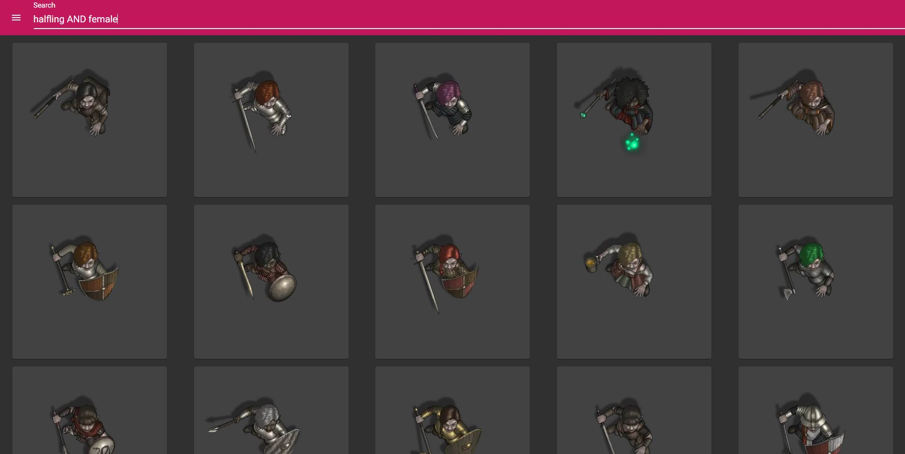

# Art Library

A webapp intended to organize images and art for VTT applications.

## Disclaimer
The software is still in very early development (less than 5 workdays old actually),
so *do not run it on the public internet* without extra protection (e.g. an Nginx reverser proxy hiding it behind proper authentication).
Also, please don't upload any super-important / confidential / private material.

## Credits
TODO: mention artist from screenshots

## What is it?
During the COVID-19 pandemic I started collecting heaps and heaps of artwork, tokens and battlemaps
for online playing P&P games like Dungeons & Dragons 5, Pathfinder 2, Splittermond and Shadowrun with my friends.
You could say I became addicted to Patreon and with several thousand tokens and maps at hand I figured it was time
to somehow organize them.

I wanted some software that I could host alongside my own Foundry VTT server, that offered me a quick search
function similar to Google's image search and that I could use from both my smartphone and my desktop computer.
There are several solutions available for that already of course, but I decided to try implementing one on my own,
as a hobby project.

The software as it is now is far from finished, but it is usable already.
It uses Spring Boot as a Java server, Angular in the frontend, PostgreSQL as database
and Lucene for searching files.

Further down the road I might even find time to integrate it directly into a Foundry VTT module...
but that's not yet decided.

## Features
- Uploaded images are automatically converted into webp format for VTT apps
- Thumbnails in 128x128, 256x256 and 512x512 are auto-generated during upload
- Tags are automatically generated by parsing the filename during upload
- Drag & Drop support for desktop
- Responsive layout for both desktop and mobile
- Search functionality powered by Apache Lucene (https://lucene.apache.org/), the same engine that runs AWS elastic search
- Query syntax can be found here: https://lucene.apache.org/core/2_9_4/queryparsersyntax.html
- Simple user authentication via database (users have to be added manually)

## Problems
- Uploads greater than 2GB will fail without message. That limit can be increased in the application.yml
- Changes made to image details *are* saved to the database, but will only be visible in the frontend when the image is loaded from the database again
- The frontend pretends that multiple categories are possible. That is wanted in the future, but atm the backend and database only save the first in the list

## Screenshots

TODO: include screenshots

### Main Page


### Search




### Image Details with Download and Edit buttons


### Edit Form


### Upload


### Mobile version


## How to run

### Dependencies:

- First, you need to install PostgreSQL in version 10+: https://www.postgresql.org/download/
- Then, you will need a way to compile and run a Maven project. IntelliJ Community is free of charge and quite a nice IDE: https://www.jetbrains.com/idea/download/#section=windows
- Finally, you will need NodeJS for the Angular frontend: https://nodejs.org/en/

### Setup:

#### Database

- After all dependencies are installed, we will need a database and a user for PostgreSQL
  You can run ``psql -U postgres`` from a terminal to connect to the installed database server.
  These commands in order will create a database and a user for that database:
```
create database art_library_backend;
create user art_library_backend with encrypted password 'mypass';
grant all privileges on database art_library_backend to art_library_backend;
```
- If everything went alright ```\l``` will list the new database in the psql prompt
- Under ``src/main/resources/application.yml`` you will find a default configuration already set up. Fill in the correct username and password (and maybe change the port if your database server is not running on the default port)
- Still in the yml file, change the ``jpa.hibernate.ddl-auto`` property to 'create-drop', so the server will setup the database the way it needs to

That's the database. Next is compiling the frontend.

#### Frontend
- Under ``src/main/resources/frontend/art-library-frontend`` is the code for the angular frontend
- In that directory, run "npm i", followed by "npm run build" to compile the frontend
- Files should automatically be put into ``src/main/resources/public``, which is the directory Spring Boot will automatically deliver once it starts.
  If the dist folder is for some reason *not* set to this path, please adjust the ``outputPath`` in the ``angular.json`` file

#### Backend
- Once the frontend is built, and the database is ready we can start the backend server: ``mvn spring-boot:run`` should do the trick.
- Alternatively, you can configure IntelliJ Idea to run the server:
  

#### Adding a local user to the database
- The software currently performs a simple authentication querying a user from postgres.
  To be able to login, you will need to create a user:

````
psql -U postgres
\c art_library
INSERT INTO library_user (id, username, password) VALUES (1, 'test', 'testPassword');
````

#### Testing it
If you navigate to "localhost:8080" you should be prompted with a login screen and should be able to use the credentials you created above to authenticate. :)

<b>Note: if everything works change the ddl-auto in application.yml back to "update" or the server will delete your database during every startup</b>

## Planned Features
If I find the time...

- split all images selected for upload into "sizable" 100 MB chunks and upload them, to get a more reasonable size per upload
- add a form to set categories and tags that should be added to all assets during upload
- make tags editable during upload
- fix everything listed under "problems"
- add a config page for categories and tags
- add a navigation item for each category and implicitly apply that category to each search
- automatically switch to the gallery when a search is started
- add a helper to build complex queries
- maybe encode the query in base64... it seems some of Lucene's syntax isn't working properly
- add a special config option to explicitly sync the search index back with the database
- include a dictionary when trying to auto-parse tags during upload (currently it's a regex that splits at whitespace, underscore, dash, etc.)
- build some kind of installer to get the software ready in an easier way than compiling it from source
- maybe include options for audio files as well... preview would be an audio player then, I guess
- replace the very basic and unsecure authentication with something more robust, like a google login
- if I ever get here, built a module for Foundry VTT to integrate the Lucene search, gallery and upload directly into Foundry
